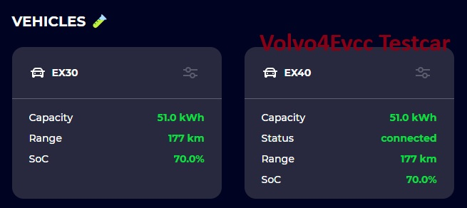
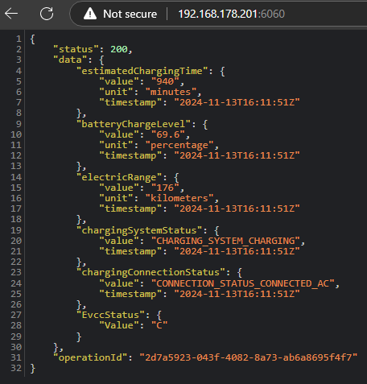
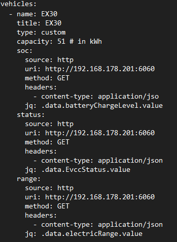

<h1># Volvo4evcc</h1>

<h3>If you like this project please sponsor me via https://buymeacoffee.com/scriptkiddie</h3>

This addon for EVCC will provide the interface between the volvo API and EVCC. It supports the 2FA Auth flow and does not need a MQTT broker. This module is build as a dedicated EVCC module in contrast tot the Volvo2MQTT addon (That is native to Home assistend). This addon is build to improve on the issues Volvo2MQTT has and is not willing to fix for EVCC. As a bonus we have added functionality and greatly enhanced security. 

Currently we are in Release state of Rc3. this versions seems to run stable , documentation is in the wiki. 

<h3>Current State:</h3>
- First Release candidate RC3 is in the main branch release and running stable in production now for over 7 days (Linux host)
- Weather Module available in the branch - stable in production for 2 days. will move to master soon.

<h3>Features in current RC3 release module: (See wiki for instalation instructions done)</h3>

- ** Car status is auto detectable by EVCC
- ** No Constant live poll Only poll when connected and charging. Update poll intervall based on connection and SOC (high interval when charging, low interval when connected but not charging, super low interval when not connected)
- ** Only pull data interresting for EVCC from API to increase security (Not exposing coordinates and door unlock to possible hackers) 
- ** Request minimal Oauth scope in auth session to improve security (Token does not include unlock or coordinate permissions)
- ** Handle all credentials encrypted at all times
- ** Volvo4Evcc is using a super light weight web instance to host the JSON response meaning no MQTT or extra broker is needed.
- ** Reduction in 80% of API traffic VS Volvo2MQTT, Meaning less traffic to your car and battery drain
- Support for Volvo 2FA authentication
- Application is Multi threaded to increase flexability 
- Direct EVCC Yaml intergration
- Auto application restarts and startup via crontab no matter if app is started allready

**Improvement over Volvo2MQTT

<h3>Added Features:</h3>
- Weather forecast support to auto set the MINSOC charging value based on solar hours for the next 3 days so you dont have to update your plan manual. It will increase when low sun and decrease when sun forcasting is good. Always keeps a buffer for unforcasted sun. 

<h2>Wiki Items</h2>
Instalation prerequisits:
https://github.com/MartijnvanGeffen13/Volvo4evcc/wiki/0-Installation-Prerequisites

Installation instructions of the module
https://github.com/MartijnvanGeffen13/Volvo4evcc/wiki/1-Installation-of-Volvo4Evcc

EVCC Yaml Code:
https://github.com/MartijnvanGeffen13/Volvo4evcc/wiki/2-EVCC-Yaml-Code

Roadmap Items:

- Implement improved solar charning by detecting SOC and set modes (PV,minPV) based on the SOC state.
- Multi volvo car support
- EVCC template has pull request to be merged into EVCC master 
  
  

