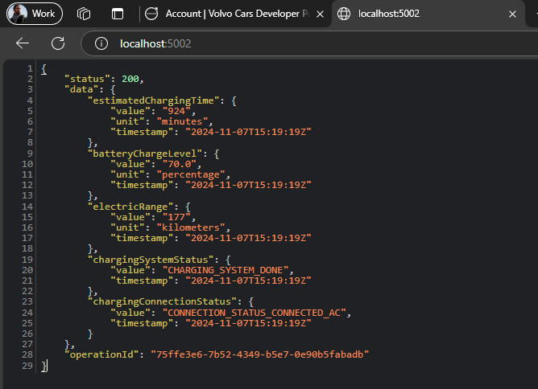
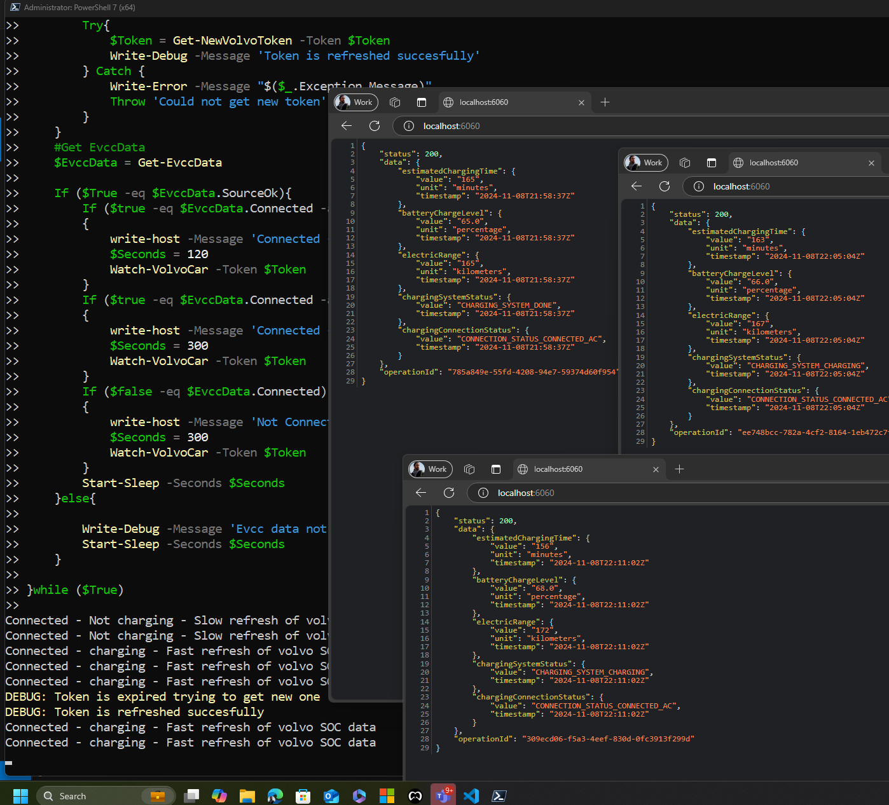

# Volvo4evcc

This addon for EVCC will provide the interface between the volvo API and EVCC. It supports the 2FA Auth flow and does not need a MQTT broker. This module is build as a dedicated EVCC module. 

You can also try a a full feature set build for Home assistend via the Volvo2MQTT addon but it has some drawbacks if used for EVCC. That is why this addon was build to improve on those challanges.

Currently we are in a Minimal viable product state meaning we have some raw working code that is not ready for production. 

Features in current Alpha release module:

- Car status should be auto detectable by EVCC
- Support for Volvo 2FA authentication
- No Constant live poll Only poll when connected and charging. Update poll intervall based on connection and SOC (high interval when charging, low interval when connected but not charging, super low interval when not connected)
- Only pull data interresting for EVCC from API to increase security
- Request minimal Oauth scope in auth session to improve security
- Handle all credentials encrypted at all times
- Application is Multi threaded to increase flexability 
- Volvo4Evcc is using a super light weight web instance to host the JSON response meaning no MQTT or extra broker is needed.
- Direct EVCC Yaml intergration

Roadmap Items:

- Implement improved solar charning by detecting SOC and set modes (PV,minPV) based on the SOC state.

